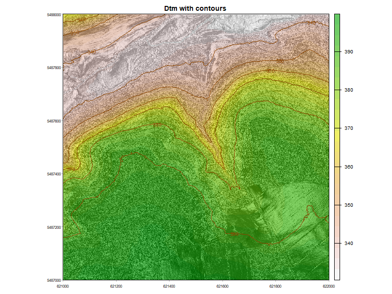
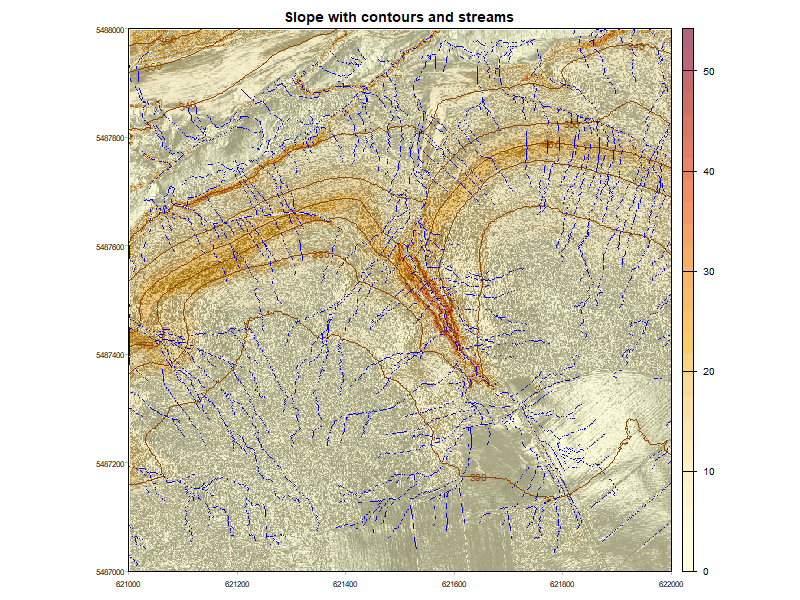
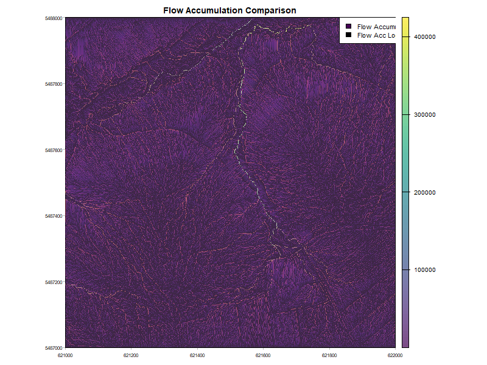
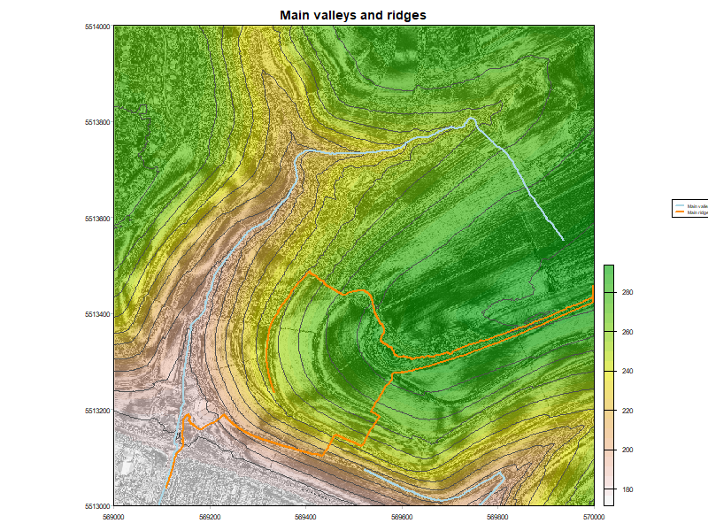
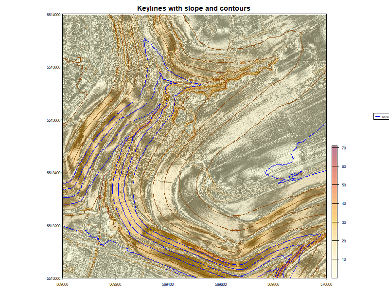

# Rkeyline

**Rkeyline** is an R package to support desktop keyline design planning and terrain analysis from Digital Elevation Models (DTMs). It provides a complete workflow from raw DTM data to approximate keyline design, covering geomorphological analysis, valley and ridge network extraction, and visualization.

> ⚠️ Generated keylines are computational approximations for desktop planning only. Always verify and adjust keylines on-site with an experienced practitioner before implementation.

---

## Installation

```r
# install.packages("remotes")
remotes::install_github("Lenaelu/Rkeyline")
```

### Dependencies

Make sure you have the following packages installed:

```r
install.packages(c("terra", "sf", "dplyr", "smoothr", "shiny", "viridis"))
```

Rkeyline also requires **WhiteboxTools**, which is used for hydrological processing (depression filling, flow direction, flow accumulation, and stream extraction) and for converting raster stream networks to vector lines. WhiteboxTools cannot work with R objects directly — it reads and writes files on disk, which is why a persistent output folder is required.

```r
install.packages("whitebox")
whitebox::install_whitebox()
```

---

## Important: Output Folder

Several functions use WhiteboxTools under the hood, which requires intermediate files to be written to disk. **You must specify an `output_folder` that exists and is writable on your system.** Both `calc_geomorph_metrics()` and `extract_networks()` need access to the same folder — files written in Step 2 are read again in Step 3.

> ⚠️ Do not rely on the default `tempdir()`. Temporary directories are cleared when your R session ends, so if you restart R between steps the intermediate files will be gone and `extract_networks()` will fail. Always set a persistent folder explicitly.

```r
# Set once and reuse throughout the entire workflow
output_folder <- "C:/my_project/rkeyline_temp"   # Windows
output_folder <- "/home/user/my_project/temp"     # Mac/Linux
```

The following files are written by `calc_geomorph_metrics()` and must still be present when `extract_networks()` runs:

- `temp_dtm.tif`, `dtm_filled.tif`, `flow_pointer.tif`, `flow_acc.tif`, `streams.tif`
- `dtm_inverted.tif`, `dtm_filled_inverted.tif`, `flow_pointer_inverted.tif`, `flow_acc_inverted.tif`, `streams_inverted.tif`

Temporary shapefiles created by `extract_networks()` are deleted automatically after use.

---

## Workflow Overview

The package follows a clear step-by-step workflow:

```
DTM → calc_geomorph_metrics()
         ↓
      extract_networks()        (valleys & ridges)
         ↓
      extract_main_valleys()
      extract_main_ridges()
         ↓
      create_keylines()
         ↓
      plot_*() functions
```

---

## Usage

A small example DTM is included in the package to get started quickly. You can use it to run the full workflow without needing your own data:

```r
library(terra)
library(Rkeyline)

# Load the built-in example DTM
dtm <- terra::rast(system.file("extdata", "example_dtm.tif", package = "Rkeyline"))
```

Or load your own DTM:

```r
dtm <- terra::rast("path/to/your/dtm.tif")
```

### Step 1: Set your output folder

```r
# Define your output folder once and reuse throughout the workflow
output_folder <- "C:/my_project/rkeyline_temp"   # Windows
output_folder <- "/home/user/my_project/temp"     # Mac/Linux
```

### Step 2: Calculate geomorphology metrics

This is the foundation of the entire workflow. Run it once and reuse the results. WhiteboxTools writes intermediate raster files to `output_folder` — these must remain available for Step 3.

```r
metrics <- calc_geomorph_metrics(dtm, output_folder = output_folder)
```

Returns slope, aspect, hillshade, contours, flow accumulation, stream networks, and their inverted equivalents for ridge analysis.

Key parameters:

- `output_folder` — path for WhiteboxTools intermediate files (**must be the same in Step 3**)
- `contour_interval` — elevation spacing for contours (default: 10)
- `stream_threshold` — number of cells required to form a stream (default: 1000)
- `breach_dist` — maximum breach distance for depression filling (default: 50)

### Step 3: Extract valley and ridge networks

WhiteboxTools reads the intermediate files written in Step 2. **Pass the same `output_folder` as in Step 2.**

```r
valleys <- extract_networks(dtm, type = "valley", metrics = metrics, output_folder = output_folder)
ridges  <- extract_networks(dtm, type = "ridge",  metrics = metrics, output_folder = output_folder)
```

### Step 4: Extract main valleys and ridges

Select the top N valley and ridge lines ranked by flow accumulation.

```r
main_valleys <- extract_main_valleys(valleys, dtm, nr_main = 2, metrics = metrics)
main_ridges  <- extract_main_ridges(ridges,  dtm, nr_main = 2, metrics = metrics)
```

### Step 5: Generate approximate keylines

```r
valley_keylines <- create_keylines(dtm, main_valleys, metrics$contours, n_keylines = 3)
ridge_keylines  <- create_keylines(dtm, main_ridges,  metrics$contours, n_keylines = 3)
```

---

## Visualization

All plot functions accept pre-calculated metrics for efficiency.

### DTM with hillshade and contours

```r
plot_dtm_contours(dtm, metrics = metrics)
```



---

### Slope with contours and stream network

```r
plot_slope_channels(dtm, metrics = metrics)
```



---

### Flow accumulation comparison

```r
plot_flow_acc(dtm, metrics = metrics)
```



> 💡 In the package this is fully interactive — toggle layers and adjust opacity via a Shiny app.

---

### Main valley networks

```r
plot_main_networks(dtm, main_valleys = main_valleys, metrics = metrics)
```

---

### Main ridge networks

```r
plot_main_networks(dtm, main_ridges = main_ridges, metrics = metrics)
```

---

### Combined valleys and ridges

```r
plot_main_networks(dtm, main_valleys = main_valleys, main_ridges = main_ridges, metrics = metrics)
```



---

### Keylines with slope and contours

```r
plot_keylines(dtm, metrics = metrics, keylines = valley_keylines)
```



---

## Function Reference

| Function | Description |
| --- | --- |
| `calc_geomorph_metrics()` | Calculate all terrain and hydrological metrics from a DTM |
| `extract_networks()` | Extract valley or ridge networks |
| `extract_main_valleys()` | Identify main valley lines by flow accumulation |
| `extract_main_ridges()` | Identify main ridge lines by flow accumulation |
| `create_keylines()` | Generate approximate keylines from valley or ridge lines |
| `plot_dtm_contours()` | Plot DTM with hillshade and contours |
| `plot_slope_channels()` | Plot slope with contours and stream network |
| `plot_flow_acc()` | Interactive Shiny app for flow accumulation comparison |
| `plot_main_networks()` | Plot DTM with main valley and ridge lines |
| `plot_keylines()` | Plot keylines with slope and contours |

---

## About Keyline Design

Keyline design is a land and water management methodology developed by P.A. Yeomans. It uses the natural topography of a landscape — particularly valley and ridge lines — to guide water flow and distribution across a property. This package provides computational tools to support the desktop planning phase of keyline analysis.

---

## License

MIT

---

## Acknowledgements

The algorithms in this package are based on the [TopoDrain plugin](https://github.com/wickit7/topo-drain-plugin), which provided the methodological foundation for the terrain analysis.
